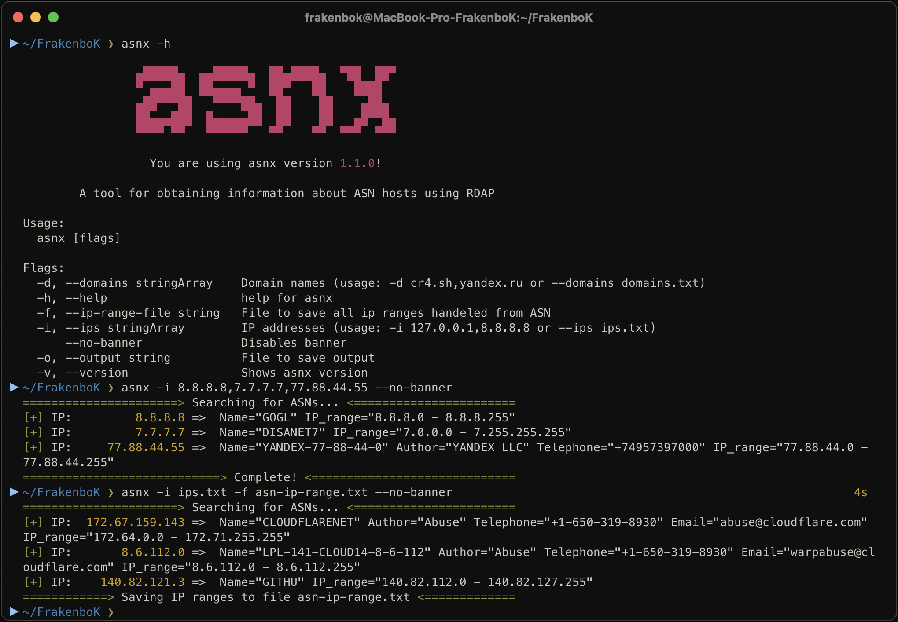

<h1 align="center">asnx</h1>

<h4 align="center">A CLI tool for obtaining information about <a href="https://en.wikipedia.org/wiki/Autonomous_system_(Internet)">ASN</a> hosts using RDAP</h4>

<p align="center">
  <a href="#features">Features</a> •
  <a href="#installation">Installation</a> •
  <a href="#usage">Usage</a>
</p>

# Features


# Installation

### Golang package:
```bash
go install github.com/FrakenboK/asnx@latest
```

# Usage

```
frakenbok@frakenbok$ asnx -h

		▄█████▄  ▄▄█████▄  ██▄████▄  ▀██  ██▀
		▀ ▄▄▄██  ██▄▄▄▄ ▀  ██▀   ██    ████
		▄██▀▀▀██   ▀▀▀▀██▄  ██    ██    ▄██▄
		██▄▄▄███  █▄▄▄▄▄██  ██    ██   ▄█▀▀█▄
		▀▀▀▀ ▀▀   ▀▀▀▀▀▀   ▀▀    ▀▀  ▀▀▀  ▀▀▀

		  You are using asnx version 1.1.0!

	A tool for obtaining information about ASN hosts using RDAP

Usage:
  asnx [flags]

Flags:
  -H, --hosts stringArray      Hosts (usage: -h ya.ru,8.8.8.8 or --hosts hosts.txt)
  -h, --help                   help for asnx
  -f, --ip-range-file string   File to save all ip ranges handeled from ASN
      --no-banner              Disables banner
  -o, --output string          File to save output
  -v, --version                Shows asnx version
```

<div align="center">

**asnx** is made by [FrakenboK](https://github.com/FrakenboK) under [MIT License](LICENSE).

</div>